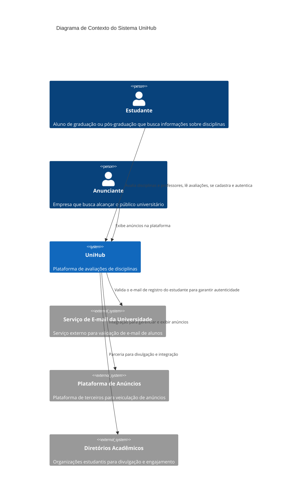
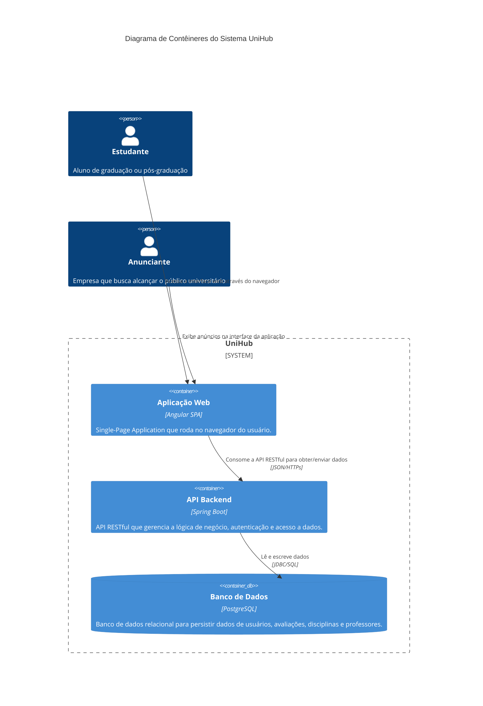

## Diagramas (C4)
Os diagramas C4 (Context, Container, Component, e Code) são utilizados para documentar a arquitetura de software de forma hierárquica e visual. Abaixo, apresentamos os três primeiros níveis para o projeto UniHub.

### Contexto
Este diagrama de alto nível mostra o UniHub como um sistema único, seus usuários e as interações com sistemas externos.



### Contêiners
Este diagrama amplia o UniHub, mostrando os principais "contêineres" tecnológicos que o compõem.



### Componentes
Este diagrama mostra a estrutura interna do contêiner "API Backend", detalhando os componentes lógicos.

```mermaid
 C4Component
        title Diagrama de Componentes do Backend do UniHub

        Container(backend, "API Backend", "Spring Boot", "API RESTful que gerencia a lógica de negócio, autenticação e acesso a dados.") {
            Component(controller, "Controller", "Spring MVC", "Expõe os endpoints da API REST.")
            Component(service, "Service", "Java", "Implementa a lógica de negócio da aplicação.")
            Component(repository, "Repository", "Spring Data JPA", "Abstrai o acesso ao banco de dados.")
            Component(domain, "Domínio/Modelo", "Java", "Representa as entidades de negócio e DTOs.")
            Component(security, "Security", "Spring Security, JWT", "Gerencia a autenticação e autorização stateless.")
        }
        ContainerDb(database, "Banco de Dados", "PostgreSQL", "Armazena informações de usuários, disciplinas e avaliações.")
        Component(frontend, "Aplicação Web", "Angular", "Consome a API.")

        Rel(frontend, controller, "Faz requisições HTTPs para a API")
        Rel(controller, service, "Invoca a lógica de negócio")
        Rel(service, repository, "Persiste e recupera dados")
        Rel(repository, database, "Interage com o banco de dados via JPA")
        Rel(controller, security, "Verifica a autenticação e autorização do usuário")
```
