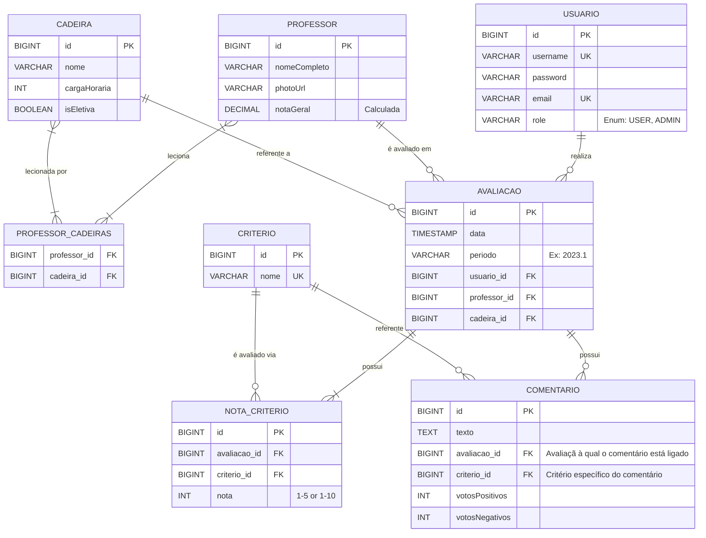

## Diagrama Entidade-Relacionamento (Planejada)

```mermaid
erDiagram
    USUARIO {
        BIGINT id PK
        VARCHAR username UK
        VARCHAR password
        VARCHAR email UK
        VARCHAR role "Enum: USER, ADMIN"
    }

    PROFESSOR {
        BIGINT id PK
        VARCHAR nomeCompleto
        VARCHAR photoUrl
        DECIMAL notaGeral "Calculada"
    }

    CADEIRA {
        BIGINT id PK
        VARCHAR nome
        INT cargaHoraria
        BOOLEAN isEletiva
    }

    PROFESSOR_CADEIRAS {
        BIGINT professor_id FK
        BIGINT cadeira_id FK
    }

    CRITERIO {
        BIGINT id PK
        VARCHAR nome UK
    }

    AVALIACAO {
        BIGINT id PK
        TIMESTAMP data
        VARCHAR periodo "Ex: 2023.1"
        BIGINT usuario_id FK
        BIGINT professor_id FK
        BIGINT cadeira_id FK
    }

    NOTA_CRITERIO {
        BIGINT id PK
        BIGINT avaliacao_id FK
        BIGINT criterio_id FK
        INT nota "1-5 or 1-10"
    }

    COMENTARIO {
        BIGINT id PK
        TEXT texto
        BIGINT avaliacao_id FK "Avaliaçã à qual o comentário está ligado"
        BIGINT criterio_id FK "Critério específico do comentário"
        INT votosPositivos
        INT votosNegativos
    }
    
    USUARIO ||--o{ AVALIACAO : "realiza"
    PROFESSOR ||--o{ AVALIACAO : "é avaliado em"
    CADEIRA ||--o{ AVALIACAO : "referente a"
    PROFESSOR }|--|{ PROFESSOR_CADEIRAS : "leciona"
    CADEIRA }|--|{ PROFESSOR_CADEIRAS : "lecionada por"
    AVALIACAO ||--|{ NOTA_CRITERIO : "possui"
    CRITERIO ||--o{ NOTA_CRITERIO : "é avaliado via"
    AVALIACAO ||--o{ COMENTARIO : "possui"
    CRITERIO ||--o{ COMENTARIO : "referente a"
```