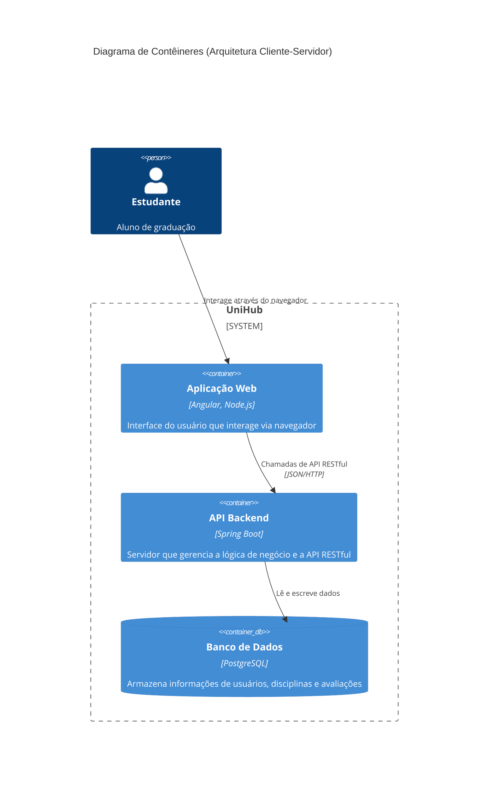
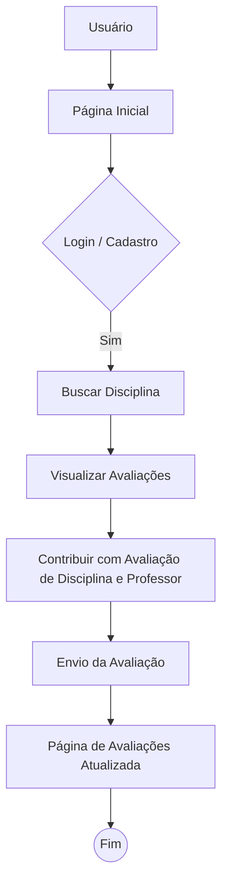
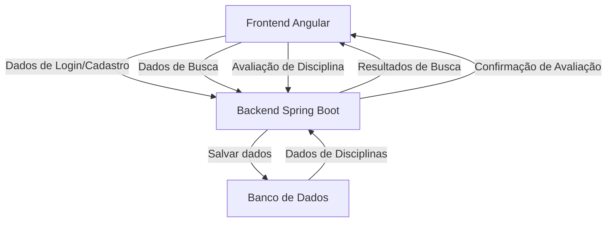

### Título do Projeto: UniHub
> Versão: [1.0.0]
Data: 10/08/2025 
Autor: Ithalo Rannieri Araujo Soares

## Sumário
- [Sumário](#sumário)
- [1. Visão Geral do Produto](#1-visão-geral-do-produto)
  - [O Problema](#o-problema)
  - [A Solução](#a-solução)
  - [Proposta de Valor](#proposta-de-valor)
  - [Público-Alvo](#público-alvo)
  - [Personas](#personas)
- [2. Arquitetura do Sistema](#2-arquitetura-do-sistema)
  - [2.1. Visão Arquitetural](#21-visão-arquitetural)
  - [2.2. Fluxo de Dados e Processos](#22-fluxo-de-dados-e-processos)
    - [2.2.1. Fluxo do Usuário (User Flow)](#221-fluxo-do-usuário-user-flow)
    - [2.2.2. Fluxo de Dados (Data Flow)](#222-fluxo-de-dados-data-flow)
- [3. Detalhes Técnicos e de Implementação](#3-detalhes-técnicos-e-de-implementação)
  - [3.1. Tecnologias e Dependências](#31-tecnologias-e-dependências)
- [3.1.xAPI Endpoints](#31xapi-endpoints)
  - [3.2. Requisitos e Qualidade](#32-requisitos-e-qualidade)
    - [3.2.1. User Stories](#321-user-stories)
    - [3.2.2. Plano de Testes (BDD - Behavior-Driven Development)](#322-plano-de-testes-bdd---behavior-driven-development)
- [4. Relatório de Lições Aprendidas](#4-relatório-de-lições-aprendidas)
  - [4.1 Planejado vs. Realizado](#41-planejado-vs-realizado)
  - [4.2 O que deu certo vs. O que deu errado](#42-o-que-deu-certo-vs-o-que-deu-errado)
    - [O que deu certo](#o-que-deu-certo)
    - [O que deu errado](#o-que-deu-errado)
  - [4.3 Próximos passos](#43-próximos-passos)
- [5. Informações Gerais e Metodologia](#5-informações-gerais-e-metodologia)

## 1\. Visão Geral do Produto
---
> O UniHub é uma plataforma de software como serviço (SaaS) projetada para centralizar e organizar informações sobre disciplinas universitárias. A solução permite que alunos e ex-alunos compartilhem suas experiências, avaliações e dicas, criando um repositório de conhecimento para auxiliar na tomada de decisão de matrícula de novos alunos.

### O Problema
A falta de informações detalhadas e confiáveis sobre as disciplinas, para além da ementa oficial, leva os alunos a fazerem escolhas de matrícula com base em rumores ou informações dispersas em grupos de mensagens e redes sociais. Isso resulta em incerteza, escolhas inadequadas de disciplinas e, em alguns casos, maior frustração e evasão.

### A Solução
O UniHub oferece uma solução centralizada e confiável, onde os alunos podem encontrar informações estruturadas sobre as disciplinas. As avaliações são baseadas em experiências reais de outros alunos, cobrindo aspectos como dificuldade, carga de trabalho, didática do professor e metodologia de avaliação. A plataforma promove a colaboração e a formação de uma comunidade acadêmica mais informada.

### Proposta de Valor

### Público-Alvo
* **Alunos de graduação:** Principalmente calouros e veteranos que precisam escolher disciplinas a cada semestre.Ex-alunos também são bem-vindos para contribuir com suas experiências e lições aprendidas.
* **Anunciantes:** Empresas de tecnologia, cursos e eventos que desejam alcançar o público universitário.

### Personas
* Persona 1: Joyce, 23 anos, aluna veterana do curso de Ciência da Computação. 
  
    * **Contexto:** Joyce já passou da fase de aluna blocada. A cada semestre, precisa montar a sua própria grade de disciplinas e se sente sobrecarregada com a falta de informações claras e confiáveis. Ela gasta um tempo considerável perguntando a colegas e em grupos de WhatsApp para entender a real carga de trabalho e o que esperar de cada matéria, mas nem sempre encontra respostas consistentes.

    * **Necessidades:** Ela busca uma plataforma centralizada e fácil de usar, onde possa encontrar avaliações detalhadas sobre as disciplinas, incluindo a metodologia de avaliação e a didática dos professores. Seu principal objetivo é tomar decisões de matrícula mais conscientes, evitando disciplinas que seriam mais "pesadas" do que o esperado.

* Persona 2: João, 20 anos, aluno blocado do curso de Engenharia da Computação. 

    * **Contexto:** Embora não tenha a liberdade de escolher suas matérias devido a seu status _blocado_, ele se sente despreparado para as exigências de cada disciplina. A ementa oficial não oferece uma visão prática da quantidade de entregas, dos projetos ou do nível de dificuldade.

    * **Necessidades:** Está prestes a iniciar sua primeira experiência profissional como estagiário e, disposto a perder o status de blocado, está em dúvida de como planejar sua matrícula para o próximo semestre. Ele precisa de uma fonte de informações para se antecipar e se preparar melhor para as disciplinas. Gostaria de ler relatos de outros alunos sobre os desafios práticos das matérias e obter dicas sobre como se organizar. Para ele, a plataforma seria um "guia de sobrevivência" para a sua jornada acadêmica.

* Persona 3: Carlos, 35 anos, gestor de marketing. 

    * **Contexto:** Carlos, 35 anos, é gestor de marketing em uma empresa de tecnologia que busca atrair talentos e promover sua marca junto ao público universitário. Ele enfrenta dificuldades em atingir esse nicho de forma eficaz através de canais genéricos, com baixo engajamento e métricas de retorno incertas. Ele precisa de um canal direto e relevante para alcançar estudantes de cursos específicos, como Ciência da Computação e Engenharia de Software.

    * **Necessidades:** Ele busca uma plataforma com um público-alvo bem segmentado, onde possa veicular anúncios direcionados para estudantes de tecnologia. Seu objetivo é aumentar a visibilidade da marca, captar currículos qualificados e ter acesso a métricas de engajamento para justificar o investimento em marketing.

## 2\. Arquitetura do Sistema
### 2.1. Visão Arquitetural
A arquitetura do UniHub adota um padrão de aplicação de três camadas (cliente-servidor-banco de dados). A aplicação é dividida em dois componentes principais: o front-end, desenvolvido com Angular, e o back-end, construído com Spring Boot. Essa separação permite maior escalabilidade, flexibilidade e a possibilidade de equipes de desenvolvimento trabalharem de forma independente. O front-end se comunica com o back-end através de uma API RESTful, e o back-end gerencia a lógica de negócio e a persistência dos dados em um banco de dados relacional.

### 2.2. Fluxo de Dados e Processos
#### 2.2.1. Fluxo do Usuário (User Flow)
Este diagrama detalha a jornada do usuário na funcionalidade principal do UniHub: buscar e contribuir com avaliações de disciplinas.

**Descrição do Fluxo:**

1. O Usuário acessa a Página Inicial e pode optar por fazer o Login/Cadastro.

2. Após a autenticação, ele pode Buscar uma Disciplina.

3. Ao encontrar a disciplina, ele acessa a Página de Avaliações para Visualizar o conteúdo existente.

4. O usuário pode então Contribuir com uma Avaliação da Disciplina e do Professor que a leciona.

5. O Envio da Avaliação é processado.

6. A Página de Avaliações é atualizada com a nova contribuição.

#### 2.2.2. Fluxo de Dados (Data Flow)
Este diagrama descreve como a informação se move entre os principais componentes da nova arquitetura.

**Descrição do Fluxo:**

1. O Frontend Angular envia dados de login, busca ou avaliação para o Backend Spring Boot.

2. O Backend Spring Boot processa a requisição e interage com o Banco de Dados para salvar as novas avaliações ou buscar informações existentes.

3. Os dados são retornados do Backend para o Frontend, que atualiza a interface do usuário.

## 3\. Detalhes Técnicos e de Implementação
### 3.1. Tecnologias e Dependências
Esta seção lista as principais tecnologias utilizadas no desenvolvimento do protótipo funcional.

* **Linguagens de Programação:** TypeScript (para o front-end), Java (para o back-end).

* **Frameworks:**
    * **Front-end:** Angular para a aplicação web.
    * **Back-end:** Spring Boot para a criação da API REST.

* **Bancos de Dados:** PostgreSQL para persistência de dados. Atualmente, a camada de dados utiliza dados mockados para facilitar o desenvolvimento e os testes iniciais.

* **Ferramentas de Build:**
    * **Front-end:** Node.js e npm.
    * **Back-end:** Maven ou Gradle.

* **Bibliotecas e Pacotes:**
    * **Front-end (Angular):** RxJS para programação reativa, Angular Material para componentes de UI.
    * **Back-end (Spring Boot):** Spring Data JPA para acesso a dados, Spring Security para autenticação e autorização, Lombok para reduzir código boilerplate.

## 3.1.xAPI Endpoints
The backend exposes RESTful API endpoints under `/api`. Key controllers include:

*   `/api/users`: Gerenciamento de usuários (admin only) e autenticação (login, register);
*   `/api/professores`: Gerenciamento de professores e listagem pública;
*   `/api/cadeiras`: Gerenciamento de cursos e listagem pública;
*   `/api/criterios`: Gerenciamento de critérios e listagem pública;
*   `/api/avaliacoes`: Submissão e recuperação de informações;
*   `/api/comentarios`: Gerenciamento de comentários.

### 3.2. Requisitos e Qualidade
A estratégia de requisitos e garantia de qualidade do projeto é baseada em Behavior-Driven Development (BDD), com os requisitos funcionais e não-funcionais (RNF) sendo documentados como User Stories. A implementação do protótipo será guiada por essas histórias, com testes unitários (TDD) implementados nos componentes, sempre que aplicável.

#### 3.2.1. User Stories
- User Story 01: Cadastro e Autenticação

> Como um novo aluno, eu quero criar uma conta e fazer login, para poder acessar e contribuir com a plataforma.

**Critérios de Aceitação:**

Dado que eu sou um novo usuário, Quando eu me cadastro com um e-mail universitário válido, Então o sistema deve criar a minha conta e me autenticar.

Dado que eu sou um usuário cadastrado, Quando eu insiro meu e-mail e senha, Então o sistema deve me logar com sucesso.

Dado que eu sou um usuário não autenticado, Quando eu tento acessar uma página restrita, Então o sistema deve me redirecionar para a página de login.

- User Story 02: Buscar e Visualizar Avaliações

> Como um aluno, eu quero buscar por disciplinas e visualizar as avaliações de outros alunos, para me ajudar a escolher as matérias para o próximo semestre.

**Critérios de Aceitação:**

Dado que eu estou na página inicial, Quando eu digito o nome de uma disciplina na barra de busca, Então o sistema deve exibir os resultados correspondentes.

Dado que eu seleciono uma disciplina, Então o sistema deve me mostrar uma página com todas as avaliações associadas a ela.

Dado que eu vejo as avaliações, Então elas devem apresentar informações estruturadas como nota, metodologia, e o relato do aluno.

- User Story 03: Contribuir com Avaliações

> Como um aluno veterano, eu quero compartilhar minha experiência sobre uma disciplina de forma anônima, para ajudar outros colegas.

**Critérios de Aceitação:**

Dado que eu estou logado, Quando eu clico em "Compartilhar Experiência" em uma disciplina, Então o sistema deve me levar a um formulário de avaliação.

Dado que eu preencho o formulário de avaliação e o envio, Então a minha contribuição deve ser publicada de forma anônima na página da disciplina.

Dado que a avaliação foi publicada, Então o sistema deve me mostrar uma confirmação de sucesso.

#### 3.2.2. Plano de Testes (BDD - Behavior-Driven Development)
O plano de testes será guiado pela metodologia BDD, utilizando os Critérios de Aceitação de cada User Story como a base para a criação dos cenários de teste em linguagem Gherkin. A equipe se compromete a utilizar TDD (Test-Driven Development) para os testes unitários, garantindo a robustez do código.

- **Cenário 01: Cadastro de novo usuário com e-mail válido**

Dado que eu estou na página de cadastro
Quando eu preencho o formulário com um e-mail de domínio universitário válido
E preencho os demais campos (senha, nome, etc.)
E clico no botão "Cadastrar"
Então o sistema deve criar minha conta com sucesso
E me autenticar automaticamente

- **Cenário 02: Busca por disciplina existente**

Dado que eu estou logado na plataforma
E a disciplina "IF781 - EMPREENDIMENTOS EM INFORMATICA" existe no banco de dados
Quando eu digito "IF781" na barra de busca
E clico no botão "Buscar"
Então o sistema deve exibir a disciplina "IF781 - EMPREENDIMENTOS EM INFORMATICA" nos resultados

- **Cenário 03: Contribuição anônima com uma avaliação**

Dado que eu estou na página da disciplina "IF781"
E eu estou autenticado
Quando eu clico no botão "Compartilhar Experiência"
E preencho o formulário de avaliação (com nota e relato)
E clico em "Enviar"
Então minha avaliação deve ser salva no banco de dados
E minha identidade de usuário não deve ser associada à avaliação
E a avaliação deve aparecer na página da disciplina com o nome "Estudante Anônimo"

## 4\. Relatório de Lições Aprendidas
Este projeto, embora em fase inicial, forneceu aprendizados valiosos sobre a concepção e o desenvolvimento de um produto. Abaixo, destacamos o que deu certo, o que deu errado e as diferenças entre o que foi planejado e o que foi de fato realizado.

### 4.1 Planejado vs. Realizado
Tudo que foi planejado até o presente momento, foi realizado. Algumas decisões técnicas envolveram:

* **Tecnologia:** A transição de um ambiente no-code (ideia inicial) para uma arquitetura com Angular, Spring Boot e PostgreSQL foi a maior mudança. Embora tenha aumentado o tempo de desenvolvimento, permitiu maior controle sobre a escalabilidade e a personalização da plataforma.

* **Time:** O planejamento inicial não previa a utilização de ferramentas de IA como parte do fluxo de trabalho. A inclusão dessas ferramentas na prática demonstrou ser uma otimização significativa, acelerando a criação de documentação e a análise de requisitos.

### 4.2 O que deu certo vs. O que deu errado
#### O que deu certo
* **Validação da Ideia:** A pesquisa com usuários confirmou a existência de um problema real e a demanda por uma solução como o UniHub. Os dados coletados foram cruciais para validar a hipótese inicial e direcionar o desenvolvimento.

* **Colaboração e Especialização:** A divisão de responsabilidades, com o gerente de produtos focado na análise de negócio e o desenvolvedor no código, permitiu que cada um se concentrasse em sua área de expertise, otimizando o fluxo de trabalho.

* **Utilização de IA:** O uso de ferramentas de IA para a geração de documentação e outros artefatos de negócio demonstrou ser uma prática eficiente e ética para acelerar a fase de planejamento e especificação, permitindo focar em tarefas de maior complexidade.

#### O que deu errado
* **Adesão à Estratégia de Tecnologia:** Inicialmente, foi planejado o uso de uma plataforma no-code (Bubble.io) para o protótipo. No entanto, por decisão de negócio e pelas características da entrega, a arquitetura foi migrada para um stack de desenvolvimento tradicional (Angular, Spring Boot), o que gerou um atraso na fase de prototipagem, mas resultou em uma solução mais robusta e escalável a longo prazo.

### 4.3 Próximos passos
* Lançar o MVP com o escopo de usuário restrito à alunos do Centro de Informática com foco em validação e coleta de feedbacks iniciais.
* Realizar ajustes e novas análises com base nos feedbacks coletados.
* Aumentar o escopo de usuários para alunos da Universidade Federal de Pernambuco.
* Fomentar engajamento contínuo fora do período de matrícula (pico de acesso esperado).
* Captar novas receitas com parceiros do setor educacional.

## 5. Informações Gerais e Metodologia
Este documento é parte de um projeto de software que segue uma metodologia ágil. O time é composto por dois membros, com papéis e responsabilidades bem definidos:

* **Ithalo Araujo** (iras@cin.ufpe.br): Atua como Gerente de Produtos. Foi responsável por toda a documentação técnica, análise de negócios, pesquisas com usuários, análise e especificação de requisitos e outros artefatos de documentação e negócios.

* **Breno Ramos** (brsg05@cin.ufpe.br): Atua como Desenvolvedor. Foi responsável por todo o desenvolvimento e implementação de testes da solução.

> O projeto contou com o suporte de ferramentas de Inteligência Artificial (LLMs), as quais foram utilizadas de forma ética e estratégica para agilizar o processo de documentação e análise, permitindo que a equipe se concentrasse em atividades de maior valor.